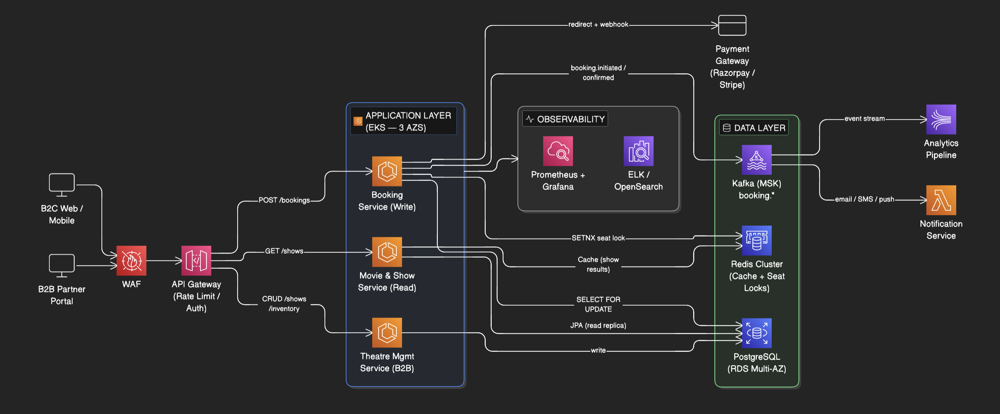
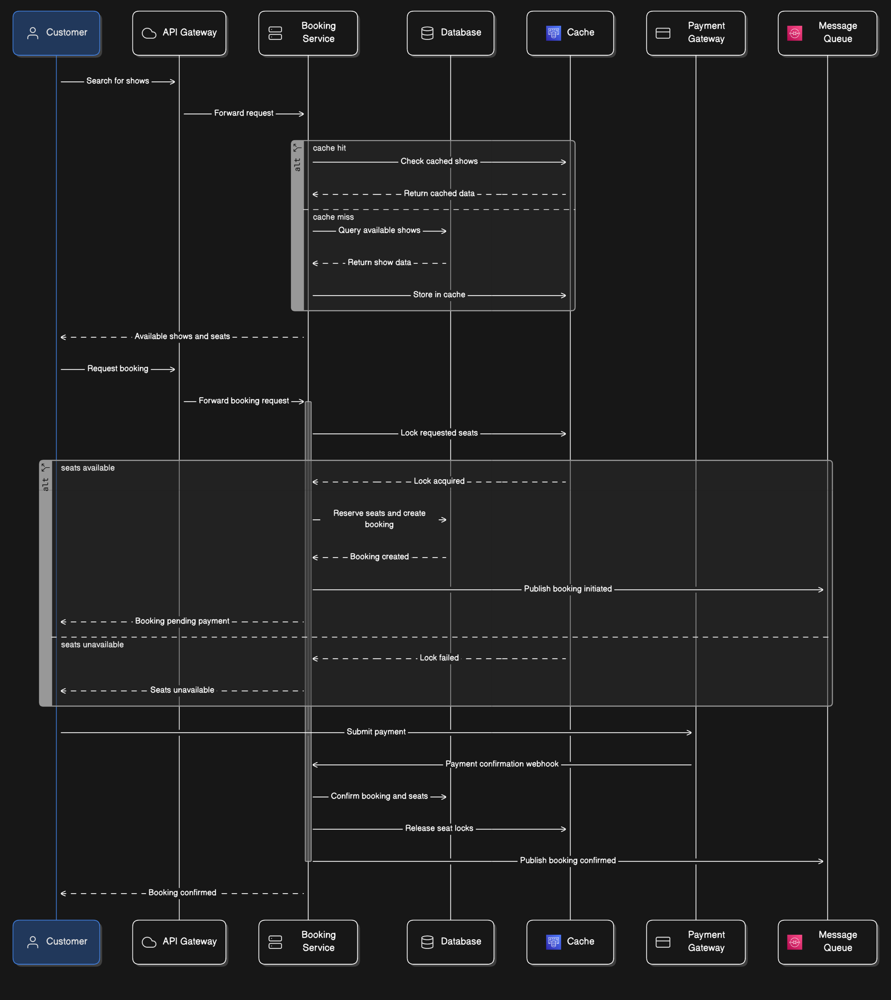

# Online Movie Ticket Booking Platform

A Spring Boot service that handles the end-to-end ticket booking lifecycle for movie theatres. It exposes a B2B API for theatre partners (onboarding theatres, managing screens and shows) and a B2C API for customers (browsing shows by city and date, selecting seats, initiating and confirming bookings). Seat contention under concurrent load is handled with Redis SETNX locks plus PostgreSQL `SELECT FOR UPDATE SKIP LOCKED`, and all discount logic follows an extensible Strategy pattern.

---

## Architecture

### High-Level Architecture



### Low-Level Flow (Booking Write Scenario)



---

## Tech Stack

| Layer | Choice | Version |
|---|---|---|
| Language | Java | 17 |
| Framework | Spring Boot | 3.2.3 |
| Persistence | PostgreSQL | 16 |
| Caching / seat locks | Redis | 7 |
| Messaging (booking events) | Apache Kafka | 7.6.0 (Confluent) |
| Schema migrations | Flyway | 9.x (via Spring Boot BOM) |
| API documentation | SpringDoc OpenAPI / Swagger UI | 2.3.0 |
| Observability | Micrometer + Prometheus (Actuator) | — |
| Build | Maven | 3.9+ |
| Container runtime | Docker + Docker Compose v2 | — |

---

## Prerequisites

Verify each tool is installed before continuing.

```bash
java -version        # must be 17 or higher
mvn -version         # must be 3.9 or higher
docker --version     # Docker Desktop 4.x or Docker Engine 24+
docker compose version  # must be v2 (shows "Docker Compose version v2.x")
```

> Docker Compose v2 ships as a plugin (`docker compose`) not a standalone binary (`docker-compose`). All commands in this README use the plugin form.

---

## Quick Start

```bash
# 1. Clone the repository
git clone <repo-url>
cd movie-ticket-booking

# 2. The .env file ships with sane local defaults — no changes needed to get started
#    Review or override any value before going beyond local testing.
cat .env

# 3. Build images and start the entire stack in the background
docker compose up --build -d

# 4. Watch the app container until it is healthy (takes ~2 minutes on a cold build;
#    Maven downloads dependencies, then Spring boots and Flyway runs migrations)
docker compose ps
```

Expected output when everything is ready:

```
NAME                SERVICE        STATUS           PORTS
movie_app           app            Up X minutes (healthy)   0.0.0.0:8080->8080/tcp
movie_kafka         kafka          Up X minutes (healthy)   0.0.0.0:9092->9092/tcp
movie_pgadmin       pgadmin        Up X minutes             0.0.0.0:5050->80/tcp
movie_postgres      postgres       Up X minutes (healthy)   0.0.0.0:5432->5432/tcp
movie_redis         redis          Up X minutes (healthy)   0.0.0.0:6379->6379/tcp
movie_redisinsight  redisinsight   Up X minutes             0.0.0.0:8001->5540/tcp
movie_zookeeper     zookeeper      Up X minutes (healthy)
```

All seven services must show `(healthy)` before hitting the API. If `movie_app` is still starting, wait another 30 seconds and re-run `docker compose ps`.

---

## Service URLs

| Service | URL | Credentials |
|---|---|---|
| API base | `http://localhost:8080/api/v1` | — |
| Swagger UI | `http://localhost:8080/api/v1/swagger-ui/index.html` | — |
| OpenAPI JSON | `http://localhost:8080/api/v1/api-docs` | — |
| Actuator health | `http://localhost:8080/api/v1/actuator/health` | — |
| Prometheus metrics | `http://localhost:8080/api/v1/actuator/prometheus` | — |
| pgAdmin 4 | `http://localhost:5050` | `admin@local.dev` / `admin` |
| RedisInsight | `http://localhost:8001` | none |

### Connecting pgAdmin to the database

1. Open `http://localhost:5050` and log in with `admin@local.dev` / `admin`.
2. Right-click **Servers** → **Register → Server**.
3. **General** tab: Name = `movie_booking`.
4. **Connection** tab:
   - Host: `postgres`
   - Port: `5432`
   - Database: `movie_booking`
   - Username: `booking_user`
   - Password: `booking_pass`

### Connecting RedisInsight to Redis

1. Open `http://localhost:8001` and click **Add Redis Database**.
2. Host: `redis`, Port: `6379`, no password.

---

## Seed Data

Flyway runs `V1__init_schema.sql` (schema) and `V2__seed_data.sql` (seed) automatically on startup. No manual step is needed.

### Theatre partners

| ID | Name |
|---|---|
| `a1000000-0000-0000-0000-000000000001` | PVR Cinemas Ltd |
| `a1000000-0000-0000-0000-000000000002` | INOX Leisure Ltd |

### Theatres

| ID | Name | City |
|---|---|---|
| `b1000000-0000-0000-0000-000000000001` | PVR Forum Mall | Bangalore |
| `b1000000-0000-0000-0000-000000000002` | PVR Orion Mall | Bangalore |
| `b1000000-0000-0000-0000-000000000003` | INOX R-City Mall | Mumbai |
| `b1000000-0000-0000-0000-000000000004` | INOX Nariman Point | Mumbai |

### Movies

| ID | Title | Language | Genre |
|---|---|---|---|
| `d1000000-0000-0000-0000-000000000001` | Kalki 2898 AD | Telugu | Action |
| `d1000000-0000-0000-0000-000000000002` | Stree 2 | Hindi | Horror Comedy |
| `d1000000-0000-0000-0000-000000000003` | The Sabarmati Report | Hindi | Thriller |
| `d1000000-0000-0000-0000-000000000004` | Amaran | Tamil | Biography |
| `d1000000-0000-0000-0000-000000000005` | Pushpa 2: The Rule | Telugu | Action |

### Customers

| ID | Name | Email |
|---|---|---|
| `e1000000-0000-0000-0000-000000000001` | Aditya Kumar | aditya@example.com |
| `e1000000-0000-0000-0000-000000000002` | Priya Sharma | priya@example.com |

### Show slots (all screens, 7 days from today)

Each screen runs four daily slots: `MORNING` (09:00), `AFTERNOON` (13:00), `EVENING` (18:00), `NIGHT` (21:30). Shows have 100 seats each (rows A–J, seats 1–10). Seat prices by category:

| Category | Rows | Surcharge | 2D AFTERNOON example |
|---|---|---|---|
| REGULAR | A–D | — | ₹150 |
| PREMIUM | E–G | +30% | ₹195 |
| RECLINER | H–J | +60% | ₹240 |

---

## API Quick Reference

All URLs are relative to the base path `http://localhost:8080/api/v1`.

### 1. Verify the service is up

```bash
curl http://localhost:8080/api/v1/actuator/health
```

```json
{"status": "UP"}
```

---

### 2. Browse shows — find theatres screening a movie in a city on a date

**Important:** Always include the `language` query parameter. Due to a Hibernate 6 null-parameter type inference issue, omitting `language` causes a `lower(bytea)` PostgreSQL error (see [Known Limitations](#known-limitations)). Pass the movie's language to filter correctly, or pass any non-matching value to get no language filter applied as a workaround.

```bash
# Kalki 2898 AD (Telugu) in Bangalore today
curl "http://localhost:8080/api/v1/shows?movieId=d1000000-0000-0000-0000-000000000001&city=Bangalore&date=$(date +%Y-%m-%d)&language=Telugu"
```

```json
{
  "success": true,
  "data": {
    "content": [
      {
        "theatreId": "b1000000-0000-0000-0000-000000000001",
        "theatreName": "PVR Forum Mall",
        "address": "Forum Value Mall, ITPL Main Rd, Whitefield",
        "city": "Bangalore",
        "latitude": 12.980801,
        "longitude": 77.72715,
        "shows": [
          {
            "showId": "<uuid>",
            "startTime": "09:00",
            "endTime": "12:00",
            "slot": "MORNING",
            "screenName": "Screen 1",
            "screenType": "2D",
            "basePrice": 120.0,
            "availableSeats": 100,
            "totalSeats": 100
          },
          {
            "showId": "<uuid>",
            "startTime": "13:00",
            "endTime": "16:00",
            "slot": "AFTERNOON",
            "screenName": "Screen 1",
            "screenType": "2D",
            "basePrice": 150.0,
            "availableSeats": 100,
            "totalSeats": 100
          }
        ]
      }
    ],
    "totalElements": 1,
    "totalPages": 1,
    "pageNumber": 0,
    "pageSize": 20
  },
  "timestamp": "..."
}
```

Additional filters (all optional):

```bash
# Filter to 3D screens only
curl "http://localhost:8080/api/v1/shows?movieId=d1000000-0000-0000-0000-000000000001&city=Bangalore&date=$(date +%Y-%m-%d)&language=Telugu&screenType=3D"

# Stree 2 in Mumbai, Hindi
curl "http://localhost:8080/api/v1/shows?movieId=d1000000-0000-0000-0000-000000000002&city=Mumbai&date=$(date +%Y-%m-%d)&language=Hindi"

# Paginate large result sets
curl "http://localhost:8080/api/v1/shows?movieId=d1000000-0000-0000-0000-000000000001&city=Bangalore&date=$(date +%Y-%m-%d)&language=Telugu&page=0&size=5"
```

---

### 3. Get the seat map for a show

The `showId` UUIDs are generated dynamically by the seed script so they will differ between fresh installs. Always fetch the seat map via the shows endpoint first to discover the correct `showId` and then `seatInventoryId` values.

```bash
# Replace SHOW_ID with a value from step 2 above
SHOW_ID="<showId from /shows response>"

curl "http://localhost:8080/api/v1/bookings/shows/${SHOW_ID}/seats"
```

```json
{
  "success": true,
  "data": [
    {
      "seatInventoryId": "11500950-5f89-42de-ae96-a3f3aae42791",
      "rowLabel": "A",
      "seatNumber": 1,
      "category": "REGULAR",
      "price": 150.0,
      "status": "AVAILABLE"
    },
    {
      "seatInventoryId": "79fd743e-0849-4d8e-8ed8-63246d25a912",
      "rowLabel": "E",
      "seatNumber": 1,
      "category": "PREMIUM",
      "price": 195.0,
      "status": "AVAILABLE"
    },
    {
      "seatInventoryId": "cae0fc68-2357-4321-968c-8ebaab300823",
      "rowLabel": "H",
      "seatNumber": 1,
      "category": "RECLINER",
      "price": 240.0,
      "status": "AVAILABLE"
    }
  ],
  "timestamp": "..."
}
```

Seat status values: `AVAILABLE`, `LOCKED` (held during payment, 10-minute TTL), `BOOKED`, `BLOCKED`.

---

### 4. Initiate a booking

Requires a valid JWT in the `Authorization` header. JWT issuance is not yet wired (see [Known Limitations](#known-limitations)), so this endpoint currently returns `403 Forbidden` until authentication middleware is added.

The call contract is shown here so integrators can build against it:

```bash
curl -X POST http://localhost:8080/api/v1/bookings \
  -H "Content-Type: application/json" \
  -H "Authorization: Bearer <jwt>" \
  -d '{
    "showId":           "<showId from /shows response>",
    "customerId":       "e1000000-0000-0000-0000-000000000001",
    "seatInventoryIds": [
      "<seatInventoryId-1>",
      "<seatInventoryId-2>",
      "<seatInventoryId-3>"
    ],
    "idempotencyKey": "session-abc-001"
  }'
```

Successful `201 Created` response:

```json
{
  "success": true,
  "data": {
    "bookingId":      "3fa85f64-5717-4562-b3fc-2c963f66afa6",
    "bookingRef":     "BK2026032900042",
    "status":         "AWAITING_PAYMENT",
    "seats": [...],
    "totalAmount":    450.00,
    "discountAmount":  75.00,
    "finalAmount":    375.00,
    "expiresAt":      "2026-03-29 10:25:00",
    "message":        "Seats reserved for 10 minutes. Please complete payment."
  },
  "timestamp": "..."
}
```

The seats are held in Redis for 10 minutes (`SEAT_LOCK_TTL_MINUTES`). If payment is not confirmed within that window, the booking transitions to `EXPIRED` and seats are released.

Submitting the same `idempotencyKey` a second time returns the original response instead of creating a duplicate booking.

**Conflict (409)** — one or more selected seats already held by another request:

```json
{
  "success": false,
  "error": {
    "code": "SEAT_UNAVAILABLE",
    "detail": "Seat A1 is no longer available"
  }
}
```

---

### 5. Confirm a booking

Called after successful payment. Transitions the booking from `AWAITING_PAYMENT` to `CONFIRMED` and promotes seat status from `LOCKED` to `BOOKED`. The call is idempotent.

```bash
curl -X POST "http://localhost:8080/api/v1/bookings/BK2026032900042/confirm?paymentRef=PAY-XYZ-123456" \
  -H "Authorization: Bearer <jwt>"
```

```json
{
  "success": true,
  "data": {
    "bookingId":      "3fa85f64-5717-4562-b3fc-2c963f66afa6",
    "bookingRef":     "BK2026032900042",
    "status":         "CONFIRMED",
    "totalAmount":    450.00,
    "discountAmount":  75.00,
    "finalAmount":    375.00,
    "expiresAt":      null,
    "message":        "Booking confirmed."
  },
  "timestamp": "..."
}
```

---

### 6. Cancel a booking

The authenticated principal must be the customer who created the booking (the `customerId` UUID is used as the Spring Security username). Cancelling a `CONFIRMED` booking logs a warning and queues a refund (stub — see [Known Limitations](#known-limitations)).

```bash
curl -X POST "http://localhost:8080/api/v1/bookings/BK2026032900042/cancel" \
  -H "Authorization: Bearer <jwt>"
```

```json
{
  "success": true,
  "data": {
    "bookingRef": "BK2026032900042",
    "status":     "CANCELLED",
    "message":    "Booking cancelled."
  },
  "timestamp": "..."
}
```

---

### 7. Health and metrics

```bash
# JSON health check
curl http://localhost:8080/api/v1/actuator/health

# Prometheus-format metrics scrape
curl http://localhost:8080/api/v1/actuator/prometheus | grep http_server
```

---

## Discount Offers

Two platform-level offers are seeded at startup and applied automatically during booking initiation. There is no coupon code to enter; eligibility is determined from the show context and the number of tickets in the booking.

### Offer 1 — Third Ticket 50% Off (`THIRD_TICKET_50`)

The third ticket (by position) in a single booking receives a 50% discount on its seat price, regardless of category or show slot.

**Example:** 3-ticket AFTERNOON booking, Screen 1 (2D), base price ₹150 per REGULAR seat.

| Position | Seat | Base price | Discount | Final price |
|---|---|---|---|---|
| 1 | A1 REGULAR | ₹150 | 0% | ₹150 |
| 2 | A2 REGULAR | ₹150 | 0% | ₹150 |
| 3 | A3 REGULAR | ₹150 | **50%** | **₹75** |
| **Total** | | **₹450** | **₹75** | **₹375** |

### Offer 2 — Afternoon Show 20% Off (`AFTERNOON_20`)

All tickets in any show with slot `AFTERNOON` (start time 12:00–17:00) receive a 20% discount.

**Example:** 2-ticket AFTERNOON booking, Screen 1 (2D), REGULAR seats at ₹150.

| Position | Seat | Base price | Discount | Final price |
|---|---|---|---|---|
| 1 | A1 REGULAR | ₹150 | 20% | ₹120 |
| 2 | A2 REGULAR | ₹150 | 20% | ₹120 |
| **Total** | | **₹300** | **₹60** | **₹240** |

### When both offers apply

If a 3-ticket afternoon booking is placed, both offers are evaluated for each ticket. The `PricingService` picks the **highest** discount per position. For position 3, offer 1 (50%) beats offer 2 (20%), so 50% is applied. Positions 1 and 2 receive 20% from offer 2.

**Example:** 3-ticket AFTERNOON booking, 2D REGULAR seats at ₹150.

| Position | Applicable offers | Applied discount | Final price |
|---|---|---|---|
| 1 | AFTERNOON_20 (20%) | 20% | ₹120 |
| 2 | AFTERNOON_20 (20%) | 20% | ₹120 |
| 3 | THIRD_TICKET_50 (50%) vs AFTERNOON_20 (20%) | **50%** | **₹75** |
| **Total** | | **₹105 off** | **₹315** |

---

## Development Workflow

### Run tests

Tests use Testcontainers (PostgreSQL) and an embedded Kafka broker. Docker must be running.

```bash
make test
# equivalent: mvn test
```

### Rebuild the app container after code changes

```bash
docker compose up -d --build app
```

Maven downloads dependencies from the layer cache so incremental rebuilds are faster after the first one.

### Tail app logs

```bash
make logs
# equivalent: docker compose logs -f app
```

### Connect to PostgreSQL directly

```bash
docker exec -it movie_postgres psql -U booking_user -d movie_booking
```

Useful queries:

```sql
-- Count shows by slot for today
SELECT slot, COUNT(*) FROM show WHERE show_date = CURRENT_DATE GROUP BY slot;

-- Check seat inventory status distribution
SELECT status, COUNT(*) FROM seat_inventory GROUP BY status;

-- View all bookings
SELECT booking_ref, status, final_amount, created_at FROM booking ORDER BY created_at DESC;
```

### Wipe all data and start fresh

This destroys all Docker volumes (database, Redis, Kafka) and rebuilds from scratch.

```bash
make clean && make up
# equivalent: docker compose down -v && docker compose up -d
```

Flyway will re-run both migrations on the next startup, so the seed data is restored automatically.

---

## Project Structure

```
movie-ticket-booking/
├── docker/
│   └── Dockerfile                  # Two-stage build: Maven builder + JRE runtime
├── src/
│   └── main/
│       ├── java/com/moviebooking/
│       │   ├── MovieBookingApplication.java
│       │   ├── config/
│       │   │   ├── RedisConfig.java         # Lettuce connection pool + JSON codec
│       │   │   └── SecurityConfig.java      # Spring Security filter chain (JWT stub)
│       │   ├── controller/
│       │   │   ├── MovieController.java     # GET /shows — browse shows by movie/city/date
│       │   │   └── BookingController.java   # POST /bookings, confirm, cancel, seat map
│       │   ├── dto/
│       │   │   ├── request/                 # ShowSearchRequest, BookingRequest
│       │   │   └── response/                # ApiResponse, BookingConfirmationDto, SeatAvailabilityDto, ShowPageResult
│       │   ├── event/
│       │   │   ├── BookingEvent.java        # Kafka message payload
│       │   │   └── BookingEventPublisher.java
│       │   ├── exception/
│       │   │   ├── GlobalExceptionHandler.java
│       │   │   ├── BookingNotFoundException.java
│       │   │   └── SeatUnavailableException.java
│       │   ├── model/
│       │   │   ├── Movie.java
│       │   │   ├── Theatre.java
│       │   │   ├── Screen.java
│       │   │   ├── Seat.java
│       │   │   ├── SeatInventory.java       # Per-show seat record (price + status + version for OCC)
│       │   │   ├── Show.java
│       │   │   ├── Booking.java
│       │   │   ├── BookingItem.java         # One row per seat per booking
│       │   │   └── enums/                   # BookingStatus, ShowSlot, ShowStatus, SeatStatus
│       │   ├── repository/
│       │   │   ├── ShowRepository.java      # JPQL queries with JOIN FETCH + countQuery
│       │   │   ├── SeatInventoryRepository.java
│       │   │   ├── BookingRepository.java
│       │   │   └── MovieRepository.java
│       │   └── service/
│       │       ├── MovieService.java / MovieServiceImpl.java   # Show browse + Redis cache
│       │       ├── BookingService.java / BookingServiceImpl.java
│       │       ├── SeatLockService.java     # Redis SETNX seat hold with TTL
│       │       ├── PricingService.java      # Evaluates all strategies, picks best discount
│       │       ├── PricingStrategy.java     # Strategy interface
│       │       ├── pricing/
│       │       │   ├── ThirdTicketDiscountStrategy.java
│       │       │   └── AfternoonShowDiscountStrategy.java
│       │       ├── BookingExpiryHelper.java
│       │       └── BookingExpiryScheduler.java  # Scheduled job to expire stale bookings
│       └── resources/
│           ├── application.yml
│           └── db/migration/
│               ├── V1__init_schema.sql      # Tables, indexes, platform offers
│               └── V2__seed_data.sql        # Partners, theatres, movies, shows, seats
├── docker-compose.yml               # Core services: app, postgres, redis, zookeeper, kafka
├── docker-compose.override.yml      # Dev tools: pgAdmin, RedisInsight
├── .env                             # Local defaults (committed — no secrets)
├── Makefile                         # up, down, logs, test, build, clean
├── DESIGN.md                        # Full solution design document
└── pom.xml
```

---

## Known Limitations

The following items are intentionally incomplete in this version. They are not bugs.

**JWT authentication not wired.** Spring Security is configured to require authentication for booking mutations (`POST /bookings`, confirm, cancel) but there is no JWT validation filter. Those endpoints return `403 Forbidden` until a JWT issuer and `spring-security-oauth2-resource-server` are added. Read endpoints (`GET /shows`, `GET /bookings/shows/*/seats`, actuator, Swagger) are fully public and work without credentials.

**Null `language` parameter causes 500 on `/shows`.** When `language` is omitted, Hibernate 6 infers the parameter type as `bytea` rather than `varchar`, which triggers a PostgreSQL `function lower(bytea) does not exist` error. Workaround: always pass `language=<movie-language>` in the query string. This is a Hibernate 6.x JPQL limitation with nullable typed parameters.

**Refund is a stub.** Cancelling a `CONFIRMED` booking logs a warning message. No payment gateway call is made to reverse the charge. A `payment_ref` column exists on the `booking` table but refund processing is not implemented.

**Seat lock expiry is scheduler-based.** The `BookingExpiryScheduler` runs periodically to flip `AWAITING_PAYMENT` bookings past their `expires_at` timestamp to `EXPIRED`. There is no event-driven TTL callback from Redis; the Redis TTL releases the lock key but the DB row status is updated by the scheduler.

**No customer-facing authentication flow.** There is no `/auth/login` or `/auth/register` endpoint. Customers are pre-seeded in the `customer` table. The `customerId` in `BookingRequest` is accepted as-is.

**Kafka events are fire-and-forget.** `BookingEventPublisher` publishes booking state change events to Kafka but there are no consumers in this service. Downstream services are expected to subscribe to those topics.

**No admin API.** Theatre, screen, and show management (CRUD) is handled directly via the database. Admin REST endpoints are out of scope for this iteration.

---

## Environment Variables Reference

All variables are defined in `.env`. The table below documents every variable the application reads.

| Variable | Default | Description |
|---|---|---|
| `APP_PORT` | `8080` | Host port mapped to the app container |
| `DB_HOST` | `postgres` | PostgreSQL hostname (service name inside Docker) |
| `DB_PORT` | `5432` | PostgreSQL port |
| `DB_NAME` | `movie_booking` | Database name |
| `DB_USERNAME` | `booking_user` | Database user |
| `DB_PASSWORD` | `booking_pass` | Database password |
| `REDIS_HOST` | `redis` | Redis hostname |
| `REDIS_PORT` | `6379` | Redis port |
| `REDIS_PASSWORD` | _(empty)_ | Redis password — leave empty for no auth |
| `KAFKA_BROKERS` | `kafka:29092` | Kafka bootstrap server address |
| `SEAT_LOCK_TTL_MINUTES` | `10` | How long seats are held in Redis pending payment |
| `JWT_SECRET` | `change_me_...` | Secret used to sign/verify JWTs — must be replaced in production |
